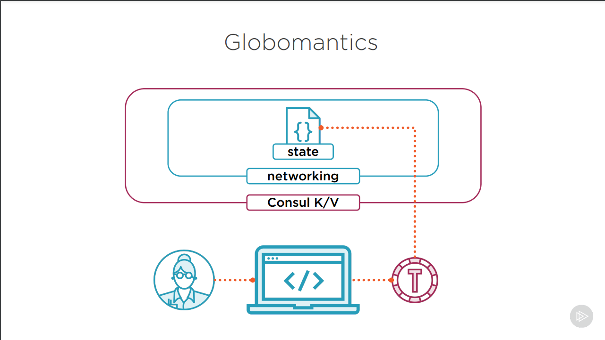

# Terraform - Deep Dive

## Notes

### Intro and Recap

#### Additional Technologies

- **Amazon Web Services** for cloud
- **Docker** for containerization
- **Jenkins** for CI/CD
- **Ansible** for configuration management
- **Consul** for storage of remote state and configuration data

#### Course Content

- Import existing resources
- Data sources and templates
- Managing state data
- Adding a CI/CD pipeline
- Workspaces and collaboration
- Integrate with config managers

### Working with Existing Resources

#### Globomantics Environment

- Using AWS for cloud provider
- Terraform for network deployment
- Network consistency and security
- Tagging per company policies

#### The Import Command

```
# Command syntax
terrafrom import [options] ADDR ID

# ADDR - configuration resource identifier
# Ex. - module.vpc.aws_subnet.public[2]

# ID - provider specific resource identifier
# Ex. - subnet-ad53afg9

# Importing a subnet into a configuration

terraform import -var-file="terraform.tfvars" \
    module.vpc.aws_subnet.public[2] subnet-ad536afg9
```

### Managing State in Terraform

- State data exploration
- Backend options for state data
- Migrating state data

#### Terraform State

- JSON format (Do not touch!)
- Resources mappings and metadata
- Inspect through CLI
- Refreshed during operations
- Stored in backends
    - Standard & enhanced (stores and also runs terraform CLI commands)
    - Locking & workspaces

#### Terraform State Commands

- `list`: lsit objects in state data
- `show`: show details about an object
- `mv`: move an item in state
- `rm`: remove an item from state
- `pull`: output current state to stdout
- `push`: update remote state from local

#### Backends

- State data is stored in backends
- Backends must be initialized
- Parial configurations are recommended
    - If you have credentials for the remote backend it should not be hard
    coded and must be passed at run time
- Interpolation is not supported

##### Backend Example

```hcl
# Basic backend configuration

terraform {
    backend "type" {
        # backend info
        # authentication info
    }
}
```

##### Types of Backends

1. Consul
2. AWS S3 (has to be used with DynamoDB to support locking and workspaces)
3. Azure Storage
4. Google Cloud Storage

#### Consul Access



#### Migrating Terraform State

- Update backend configuration
- Run terraform init
- Confirm state migration

### Using Data Sources and Templates

- Data source types
- Config from external sources
- Templates, templates, templates

#### More Teams, More Problems

- Information Security (Define roles, policies, and groups)
- Software Development (Read network configuration for app deployment)
- Change Management (Store configuration data centrally)

#### Data Sources

- Glue for multiple configurations
- Resources are data sources
- Providers have data sources
- Alternate data sources
    - Template
    - HTTP
    - External (runs a script which has to return a valid json)
    - Consul

##### HTTP Data Source

```
# Example data source
data "http" "my_ip" {
    url = "http://ifconfig.me"
}

# Using the response
data.http.my_ip.body
```

##### Consul Data Source

```
# Consul data source
data "consul_keys" "networking" {
    key {
        name = "vpc_cidr_range"
        path = "networking/config/vpc/cidr_range"
        defualt = "10.0.0.0/16"
    }
}

# Using the resource
data.consul_keys.networking.var.vpc_cidr_range
```

#### Consul Setup


#### Templates

- Manipulation of strings
- Template is an **overloaded term**
    - Quoted strings
    - Heredoc syntax
    - Provider
    - Function
- Interpolation and directives

##### Template Strings

- When you do any interpolation you are basically using a template
- They are expressed in the configuration directly and doesn't require another
file
- You can use heredoc syntax for readability

```hcl
# Simple interpolation
"${var.prefix}-app"

# Conditional directive
"%{ if var.prefix != "" }${var.prefix}-app%{ else }generic-app%{ endif }"

# Collection directive with heredoc
<<EOT
%{ for name in local.names }
${name}-app
%{ endfor }
EOT
```

##### Template Syntax In-line

```hcl
# Template data source
data "template_file" "example" {
    count = "2"
    template = "$${var1}-$${current_count}"
    vars = {
        var1 = var.some_string
        current_count = count.index
    }
}

# Using the template
data.template._file.example.rendered
```

##### Template Syntax File

```hcl
# Template configuration
data "template_file" "peer-role" {
    template = file("peer_policy.txt")
    vars = {
        vpc_arn = vpc.vpc_arn
    }
}

# or

templatefile("peer_policy.txt", {
        vpc_arn = var.vpc_arn 
    }
)
```

```txt
# peer_policy.txt

{
    "Version": "2012-10-17",
    "Statement": [
        {
            "Action": [
                "ec2:AcceptVpcPeeringConnection",
                "ec2:DescribeVpcPeeringConnections"
            ],
            "Effect": "Allow",
            "Resource": [
                "${vpc_arn}"
            ]
        }
    }
}
```

#### Summary

- Templates for code reuse
- Data sources glue configs together
- Custom data sources are an option

### Using Workspaces and Collaboration

- Using workspaces for environments
- Collaborating with remote state
- Use remote state as a data source

#### Globomantics Environment

- Work with the larger team
- Create infrastructure for other teams
- Enable collaboration through remote state

#### State as Data Source

```hcl
data "terraform_remote_state" "networking" {
    backend = "consul"
    config = {
        path = var.network_path
        address = var.consul_address
        scheme = var.consul_scheme
    }
}
```

#### Summary

- Workspaces for environments
- Remote state for collaboration

### Troubleshooting Terraform
### Adding Terraform to a CI/CD Pipeline
### Integrating with Configuration Managers

